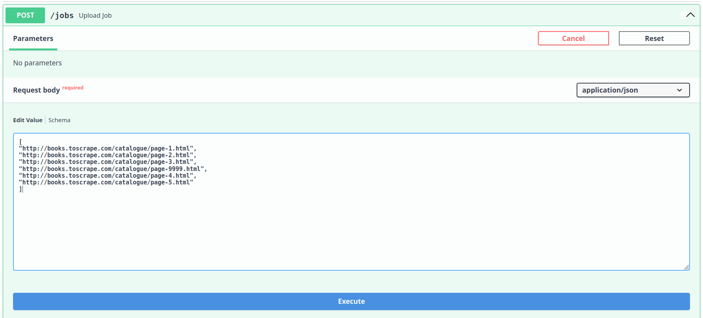
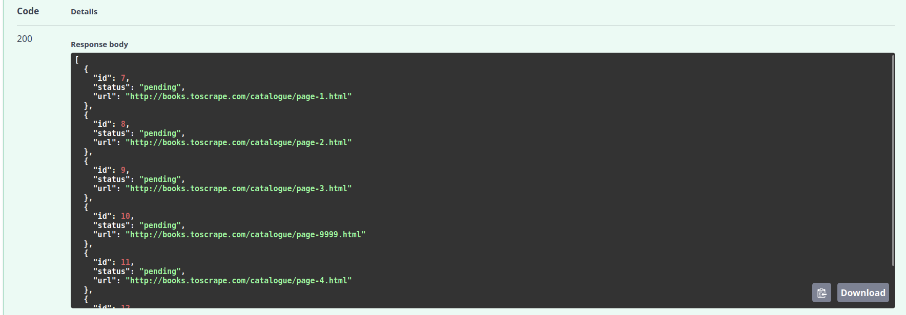
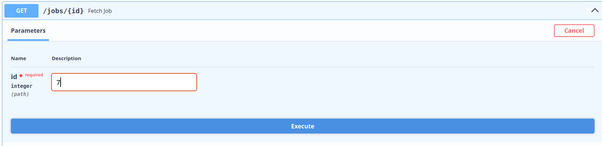
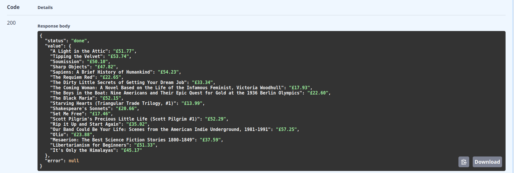
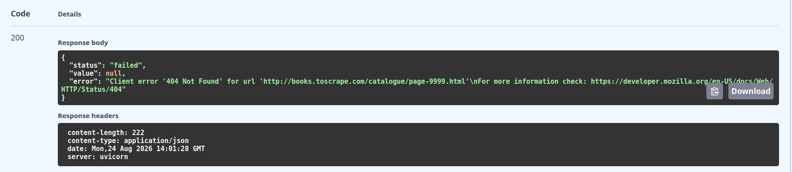
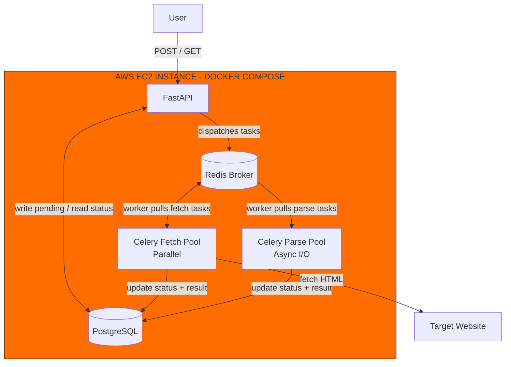

# Distributed Async Web Scraper

## Overview

A distributed web scraper that fetches URLs and parses the HTML to extract data. It runs on two distributed task queues where one handles the fetch tasks and one handles the parse tasks. The fetching is done asynchronously through the event loop across a couple of independent processes in its own worker pool, enabling concurrency. The parsing is done concurrently across multiple independent processes in its own worker pool, enabling true parallelism. It is done this way because fetching is just waiting for the webpage to load which is I/O-bound while parsing requires some computation to extract the necessary information which is CPU-bound. This is what separates the different kinds of tasks that runs on their own concurrency model that is most suited for them. 

Rate limiting is also handled by integrating a semaphore, controlling the amount of concurrent web requests that happens at once. This is to prevent flooding a web server with many requests that can be interpreted as a DDOS. Whenever a task fails, it will not crash the worker or any of the other running workers but instead will be recorded to a database for the end user to get later. This is to prevent the program from crashing unexpectedly, which not only stops other working tasks from running but ruins the end user's entire experience. This project is built as a fully containerized distributed system with `FastAPI`, `Redis`, `Celery`, and `Postgres` that runs on a single command using `Docker`.

**Important Note**: This project is only designed to test web scraping off of `https://books.toscrape.com/` for didactic reasons. It is NOT recommended to test this or to change any of this to test on different web servers. I'll include url samples in the `Usage` section.

## Running It

I was on `Python 3.14` for this project, so try to stick with that. Also, ensure you have `Docker` and `Docker Compose` installed. 

Once you cloned the repo and cd into it, you'll have to build it for the first time, so run:
```
docker compose up --build
```

For future uses if you want to shutdown the containers, run:
```
docker compose down
```

And next time you run it, run:
```
docker compose up
```

**Note**: Please reference to Docker's documentation if you want to learn more but this is the basic usage of the commands. 

**Important Note**: Ensure the workers are ready, the API finished starting up, and Redis and Postgres are ready to accept connections through the terminal. 

## Usage

I will walk you through using this sample:
```
[
"http://books.toscrape.com/catalogue/page-1.html",
"http://books.toscrape.com/catalogue/page-2.html",
"http://books.toscrape.com/catalogue/page-3.html",
"http://books.toscrape.com/catalogue/page-9999.html", # this is an invalid url, more on this later
"http://books.toscrape.com/catalogue/page-4.html",
"http://books.toscrape.com/catalogue/page-5.html"
]
```

First, go to `http://0.0.0.0:8000/docs`. 

Then make a post request using the sample, you should have something like this. Make sure all of the urls are correct. Note this specific url `http://books.toscrape.com/catalogue/page-9999.html` within our sample. It is invalid and we'll demonstrate how it is handled.



Once you execute, you'll see a list of dictionaries, each dictionary consisting of the task ids, with the status, and url for each url in the batch of urls. I already had previous executions so my task ids may differ from yours.



Then make a get request and choose an id you'd want to check. Here, I'll walk through the successful task and then a failed task. If you try to choose an id that doesn't exist, it will simply state that the id doesn't exist. I used 7 as my id input as that was the first valid url in the sample. 



If the task is finished, it will update that to the database which is how the results are retrieved. Here, you can see that this task has finished and shows the actual information that we are looking for. Notice that there's no error, so it returns `null`.



This is what a failing task looks like with this url `http://books.toscrape.com/catalogue/page-9999.html` we noted from earlier. Here the status shows that it failed with the specific error message. No value is returned here. 



## Architecture


## Project structure
Relevant files:
```
main.py # Entry point that runs the app.
app.py # FastAPI: Create and fetch jobs through POST and GET requests while updating database.
database.py # SQLAlchemy: JobTable inside of database and get_session for Depends().
tasks.py # This is where the Celery worker executes tasks and updates the results to the database.
handlers.py # Any new and existing job handlers goes here.
job.py # Job defined here.
celery_app.py # Celery app is defined here and used across modules.
tests.py # Tests exists here.
```

## License
MIT License

Copyright (c) 2026 Darin Duong

Permission is hereby granted, free of charge, to any person obtaining a copy
of this software and associated documentation files (the "Software"), to deal
in the Software without restriction, including without limitation the rights
to use, copy, modify, merge, publish, distribute, sublicense, and/or sell
copies of the Software, and to permit persons to whom the Software is
furnished to do so, subject to the following conditions:

The above copyright notice and this permission notice shall be included in all
copies or substantial portions of the Software.

THE SOFTWARE IS PROVIDED "AS IS", WITHOUT WARRANTY OF ANY KIND, EXPRESS OR
IMPLIED, INCLUDING BUT NOT LIMITED TO THE WARRANTIES OF MERCHANTABILITY,
FITNESS FOR A PARTICULAR PURPOSE AND NONINFRINGEMENT. IN NO EVENT SHALL THE
AUTHORS OR COPYRIGHT HOLDERS BE LIABLE FOR ANY CLAIM, DAMAGES OR OTHER
LIABILITY, WHETHER IN AN ACTION OF CONTRACT, TORT OR OTHERWISE, ARISING FROM,
OUT OF OR IN CONNECTION WITH THE SOFTWARE OR THE USE OR OTHER DEALINGS IN THE
SOFTWARE.